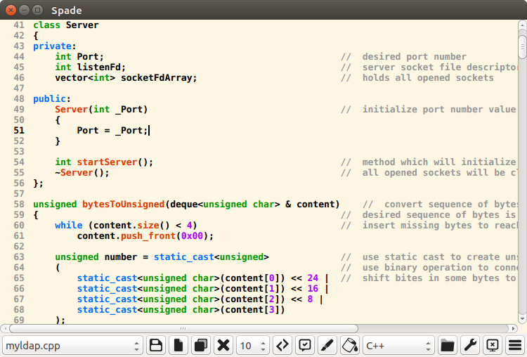

# Spade
Spade is a sophisticated code editor written in Qt.

This cross-platform code editor is implemented in C++ language with use of Qt Framework. 
Functionalities not provided and behaviors provided only by some, mostly proprietary, solutions, were taken in account in editor design. 
As well functionalities for projects manipulation used in development environments were implemented.

## Features

* Syntax highlighting.
* Source code editing with automatic indentation.
* Autosave feature.
* Support of multiple tabs.
* Searching in source code using regular expression.
* Split editing support.
* Line numbering with indication of changes.
* User highlighting of text background.
* Advanced class tree view.
* Projects management and building.
* Vim-style code editing.
* Definition of syntax highlighting for custom language.

## Build instructions

* Clone the Spade code editor repository.
* Move into the **src** directory and run **qmake** utility to generate Makefile.
* Build the executable using **make** automation tool.
* Run Spade.
